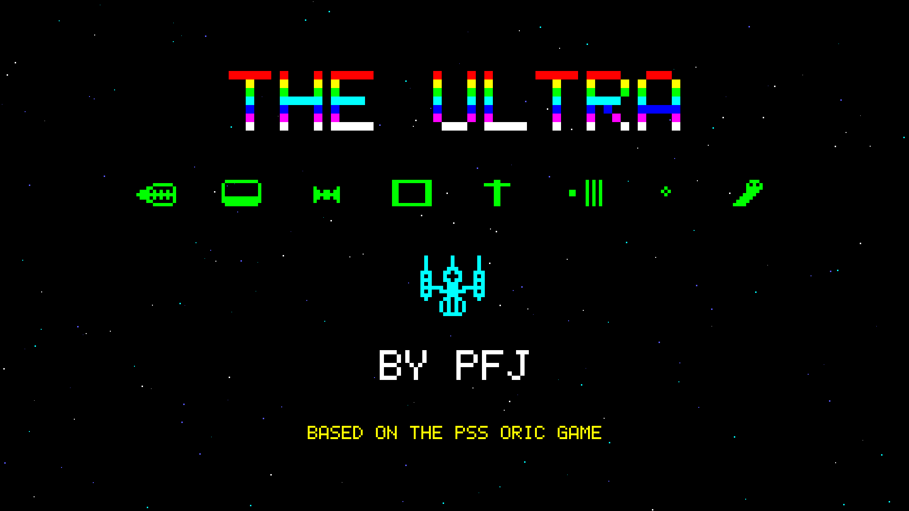

# The Ultra

A MonoGame remake for **Android** and **iOS** of *The Ultra*, the 1983 arcade shooter published by PSS for the Oric-1 and Oric Atmos.

Written by **Paul F. Johnson**.



## The game

- **16 waves of aliens**, each with its own animated graphics and attack pattern: Marchers, Wavers, Swoopers, Bouncers, Orbiters, Zigzaggers, Loopers, Kamikazes, Centipedes, Spirallers, Raindrops, Pendulums, Phantoms, Crossfire, Hunters and the Ultra. After wave 16 the cycle repeats, faster and for more points.
- **Gun overheating.** The machine gun heats up with every shot. If it reaches the limit it locks until it has cooled. The temperature carries over from one wave to the next, so you start each wave with the gun as hot as you left it.
- Aliens score 10 points on wave 1, rising by 5 per wave to 85 for the Ultra on wave 16. Diving aliens score double. You get an extra life every 10,000 points.
- Oric-style presentation: a 240x224 screen, the eight Oric colours, a 6x8 character-cell font, and AY-style square-wave and noise sound effects synthesised at runtime.

### High scores

The Hall of Fame keeps the top 10 scores. If you make the table, you enter your name (up to 10 characters) on an on-screen keyboard or a hardware keyboard. The table is saved to the app's private storage (`LocalApplicationData/ultra_hiscores.txt`) as soon as you enter your name and is loaded again when the game starts, so scores carry over from one launch to the next.

### Controls

The game is locked to landscape.

- **Move:** tilt the device like a steering wheel. Lower the right edge to go right and the left edge to go left. The further you tilt, the faster the ship moves. A tilt meter sits in the left margin.
- **Fire:** tap anywhere on the screen. Hold your finger down for rapid fire, but watch the heat gauge.
- **Pause:** the pause icon in the top-left corner, or the Back button on Android. The pause menu offers Resume, Options and Quit.

### Options

Tap the slider icon in the top-left corner of the title screen, or choose **Options** from the pause menu.

- **Tilt sensitivity** runs from 1 (low) to 10 (high). Each step needs about 20% less tilt to reach full speed. At the default of 5, full speed takes about 17°.
- **Invert tilt** reverses the steering direction.
- **Tilt test** shows a live preview of the ship, so you can tune the setting before playing.

Options are saved (`ultra_settings.txt`) and restored when the game starts.

### Title screen

The title screen cycles through three pages: **How to Play**, **Points per Alien** (every alien with its name and score) and the **Hall of Fame**.

Tilt uses the gyroscope-fused gravity vector: CoreMotion device motion on iOS and the `TYPE_GRAVITY` sensor on Android. On Android devices without a gyroscope it falls back to a filtered accelerometer. If the device has no motion sensor at all (for example the iOS Simulator), on-screen left and right buttons appear in the left margin instead. Hardware keyboards and game pads also work: arrow keys, Space or Ctrl to fire, P to pause, Esc to go back.

## Project layout

| Project | Purpose |
| --- | --- |
| `Ultra.Core` | All game code (net10.0, MonoGame 3.8.5). It needs no content pipeline because graphics, font and sound are generated in code. |
| `Ultra.Android` | Android host activity: fixed `SensorLandscape`, immersive full screen, adaptive icon, splash theme, tilt sensor |
| `Ultra.iOS` | iOS host: landscape only, app icon set, `LaunchScreen.storyboard` splash, CoreMotion tilt sensor |
| `tools/generate_art.py` | Regenerates every icon and splash image from the game's own sprite and font data (requires Pillow) |

## Building

```sh
dotnet build Ultra.Android/Ultra.Android.csproj
dotnet build Ultra.iOS/Ultra.iOS.csproj
```

You need the .NET 10 SDK with the `android` and `ios` workloads installed.

## Credits

- Original game: *The Ultra* by J.B. Marshall, published by PSS in 1983 for the Oric-1 and Atmos.
- Remake: Paul F. Johnson.
